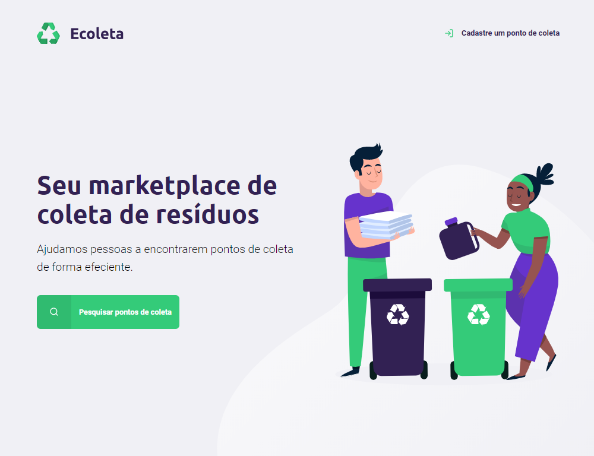
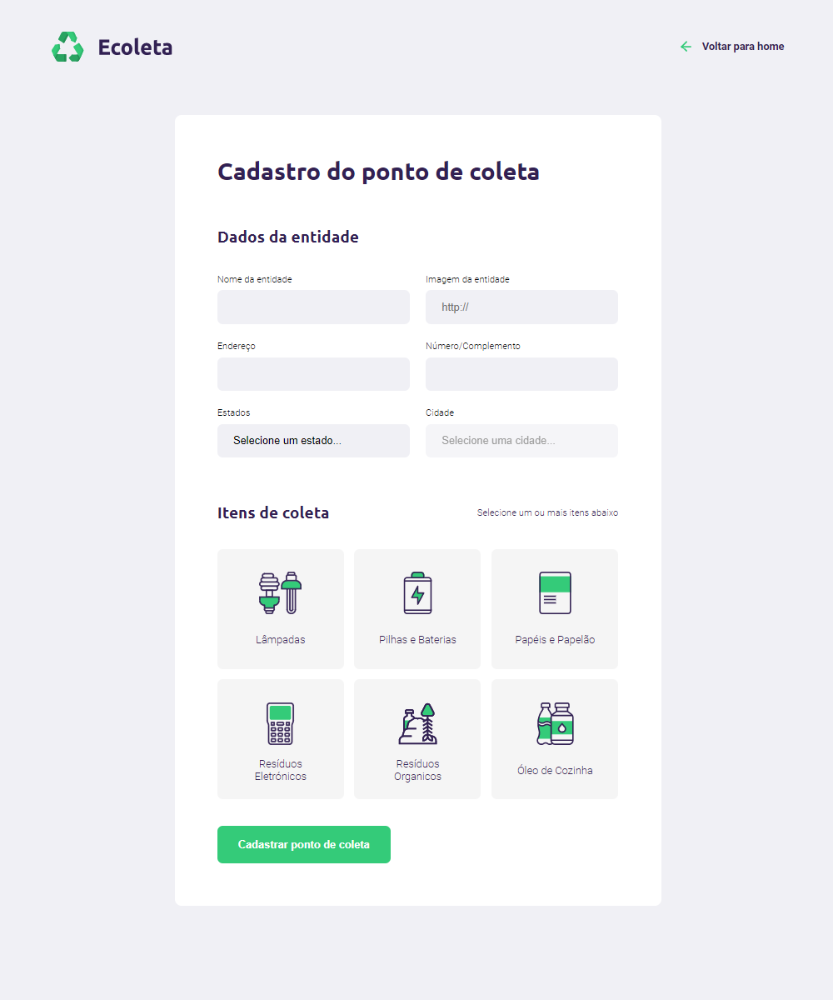
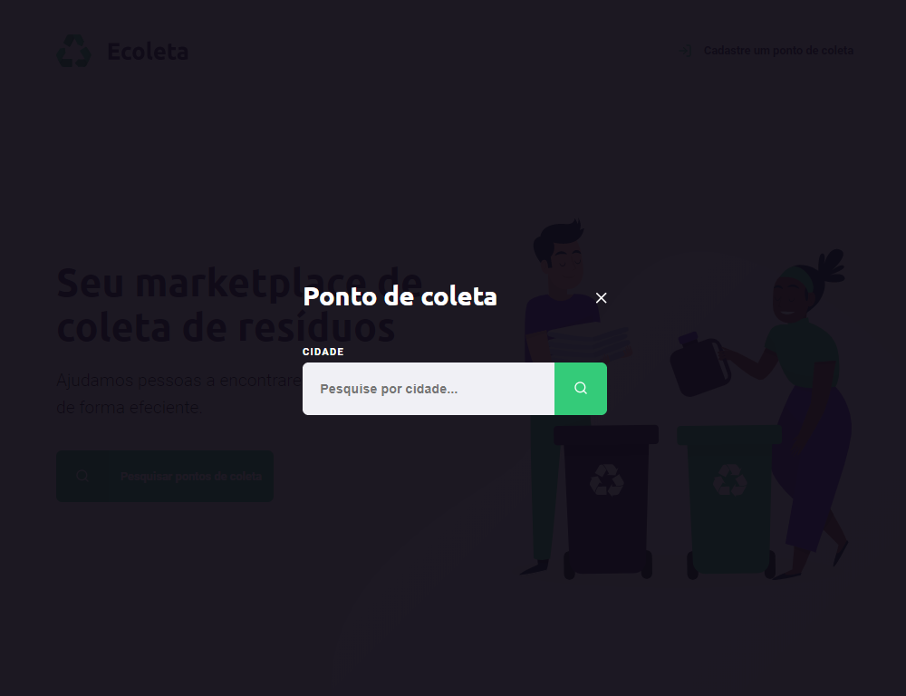
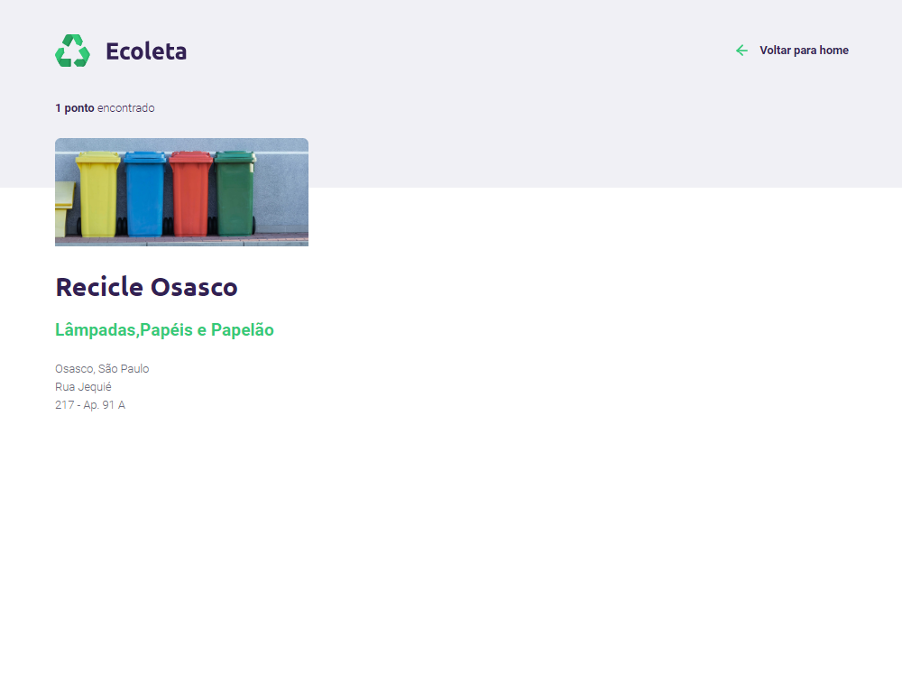

#### NEXT LEVEL WEEK #1
<p align="left">
  
</p>

[](http://doge.mit-license.org)

### Descrição do projeto
---
<p align="justify">
  <strong>Projeto ECOLETA</strong> - esse é um projeto de estudos e foi criado para organizar, cadastrar e visibilizar pontos de coleta onde as pessoas possam procurar esses pontos de coleta e com mais facilidade localiza-los para a melhorar do sistema de reciclagem
</p>

<div align="center">
  
:heavy_check_mark: Home do Ecoleta <br><br>


:heavy_check_mark: Cadastro de novos pontos de Coleta <br><br>


:heavy_check_mark: Busca dos pontos de Coleta <br><br>
 <br><br>


</div>

### :arrow_forward: Como rodar a aplicação 
---
No terminal, clone o projeto: 

```
git clone https://github.com/React-Bootcamp-WoMarkersCode/certificate-generator
```

- To Do: Coloque um passo a passo para rodar a sua aplicação.  <br>
**Dica: clone o próprio projeto e verfique se o passo a passo funciona**

### :trophy: Tecnológias & Frameworks usados
---
- **Linguagens:** html, javascript, css
- **Frameworks:** nodeJS, express, SQL


### :octocat: Team
---
| <a href="https://www.linkedin.com/in/l-rodrigues-fonseca/" target="_blank">**Leandro Fonseca**</a><br> Dev | <a href="https://www.linkedin.com/in/maykbrito/" target="_blank">**Mayk Brito**</a><br> Instrutor |
| :---: |:---:|
| [](https://www.linkedin.com/in/l-rodrigues-fonseca/) | [](https://www.linkedin.com/in/maykbrito/) | 
| <a href="http://github.com/lefonseca" target="_blank">`github.com/lefonseca`</a> | <a href="https://github.com/maykbrito" target="_blank">`github.com/maykbrito`</a> | 

### Licença 
--- 
The [MIT License]() (MIT)<br>
Copyright :copyright: 2020 - Ecoleta
